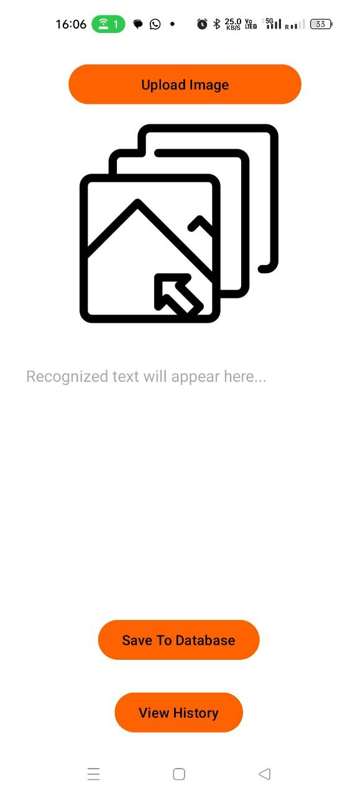

# Image-to-Text Application (Read Your Image)

This application allows users to select an image and extract all the text from it. Users can then easily copy the text to use elsewhere.

## Features

- **Image Selection**: Users can select an image from their gallery.
- **Text Extraction**: The app extracts text from the image with high accuracy.
- **Copy Text**: Easily copy the extracted text for further use.

## Screenshots

| Home Screen | Image Selection | Text Extraction |
|-------------|-----------------|-----------------|
|  |  |  |

> *Replace the placeholder images above with actual screenshots of your application.*

## Sample Video

Here's a sample video showcasing the app in action:
[](https://drive.google.com/file/d/1GIHbJEiB9rB6VS2PfKvXu9FSfqm_wEC2/view?usp=sharing)

> *Replace the video link with a link to your sample video.*

## How to Use

1. Open the app and go to the main screen.
2. Tap on the "Select Image" button to pick an image from your gallery.
3. The app will process the image and display the extracted text.
4. Tap the "Copy" button to copy the text to your clipboard.

## Technologies Used

- **Android Studio**: For application development.
- **Java**: The primary language used in the app.
- **OCR Library**: For text recognition from images.

## Installation

1. Clone the repository:
    ```bash
    git clone https://github.com/yourusername/your-repository.git
    ```
2. Open the project in Android Studio.
3. Build and run the app on an Android device or emulator.

## Contributing

Feel free to submit issues or feature requests. Contributions are welcome!
